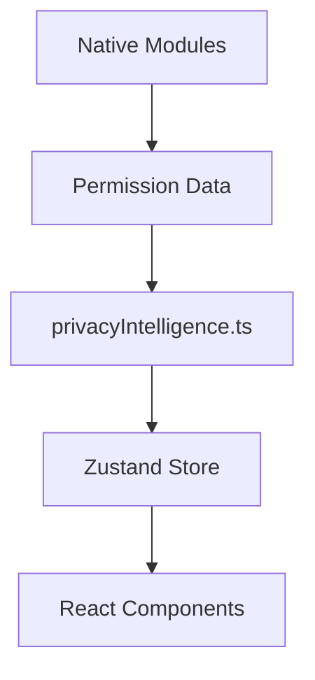
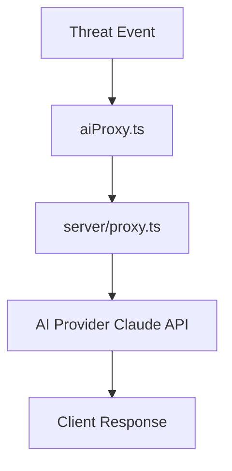
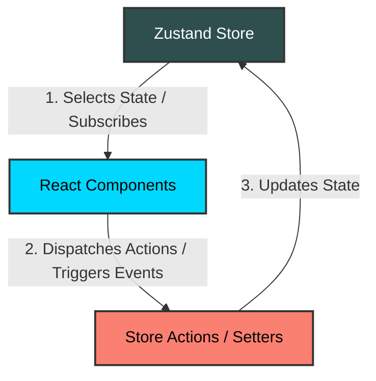

# Architecture Overview

This document explains how OMNYX system flows work.

---

## 1.Device Scan Flow

```mermaid
graph TD
A[Native Modules] --> B[Permission Data]
B --> C[privacyIntelligence.ts]
C --> D[Zustand Store]
D --> E[React Components]
```

---

## 2. AI Flow

```mermaid
graph TD
A[Threat Event] --> B[aiProxy.ts]
B --> C[server/proxy.ts]
C --> D[AI Provider Claude API]
D --> E[Client Response]
```

---

## 3. State Flow

```mermaid
graph TD
    A[Zustand Store] -->|1. Selects State / Subscribes| B[React Components]
    B -->|2. Dispatches Actions / Triggers Events| C[Store Actions / Setters]
    C -->|3. Updates State| A

    style A fill:#2f4f4f,stroke:#333,stroke-width:2px,color:#fff
    style B fill:#00d8ff,stroke:#333,stroke-width:2px,color:#000
    style C fill:#fa8072,stroke:#333,stroke-width:2px,color:#000
```

---

